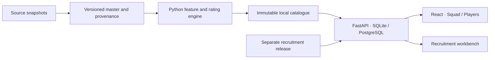

# Futty Manager · v1

**Build a lineup. Inspect the evidence. Scout the next signing.**

Futty Manager combines Scout’s squad planner, player catalogue and recruitment workbench. It runs locally with React and Python/FastAPI. The first supported squad is Liverpool’s sourced **2026/27** men’s first team; performance analysis uses frozen **2025/26** observations.

## What you can do

| Workspace | Features |
| --- | --- |
| **Squad** · `/` | Manage eleven players across five formations; swap, substitute and undo; search bench/reserves; inspect player and chemistry details; save and import/export lineups. |
| **Players** · `/players` | Browse imported profiles; filter by league, club, position and OVR; inspect six abilities, radar charts, feature distributions and source evidence. Requires an authorized local data import. |
| **Recruitment** · `/scout` | Edit a scouting brief, rank role candidates, compare players, explore replacements and assumption-driven scenarios, and export an evidence record. The portable release uses fictional candidates. |

Shared cards use rating-dependent finishes, sourced portraits/identity assets when available, and explicit fallbacks. The bench opens beside the pitch. Pointer, tap and keyboard controls are supported, along with reduced motion.

Formation changes preserve the selected eleven. **Squad OVR and all six abilities follow the assigned position**, including details and substitution previews. Goalkeeper and outfield slot types cannot be exchanged. Other clubs’ squad lineups are future work.

## Rating model

Nine editable registries cover **ST, LW/RW, LM/RM, CM, CAM, CDM, CB, RB/LB and GK**. Left/right variants share a model. Tune feature and OVR weights in [`position_rating_weights_config.yaml`](Rating%20System/position_rating_weights_config.yaml).

```text
Provider-local values and exposure
  → reliability shrinkage
  → directional feature z-scores
  → weighted, standardized ability composites
  → weighted, standardized OVR
  → max(1, 50 + 15 × z)
```

- Ratings have **no upper cap**. Percentiles describe rank separately.
- Peers are pooled across Europe’s top five leagues for the relevant position. Season ratings require **900 minutes** and **30 compatible peers**; goalkeepers stay separate.
- Explicitly zero-filled unrecorded features redistribute weight proportionally. **Recorded zero values retain their weight.** Zero-attempt ratios remain N/A; invalid and partial-window observations remain unscored.
- Assignment scoring uses the destination role without changing reference membership or adding an arbitrary out-of-position penalty. It does not establish tactical suitability.
- ST Finishing, CAM Scoring and LW/RW Scoring use **30% goals above non-penalty xG /90** and **15% non-penalty xG /90**. Coefficients remain provisional and editable.
- Chemistry is a separate **demonstration familiarity proxy**, never an OVR boost.

See the [rating rules](Rating%20System/rating_ranking_system.md), [position specifications](Rating%20System/position_attribute_methods.md) and [tuning guide](Rating%20System/position_weights_implementation.md).

## Run locally

Requires **Python 3.12**, [uv](https://docs.astral.sh/uv/) and **Node.js 24**. SQLite is the local default; PostgreSQL is supported. Java 17 is needed only for optional Spark workflows.

```powershell
git clone https://github.com/tvh-ds/futty_manager.git
cd futty_manager
uv sync --frozen --extra dev --cache-dir .cache/uv
Copy-Item .env.example .env
# Keep SCOUT_SERVE_PRIVATE_EVIDENCE=false for the portable demo.
.venv/Scripts/python.exe -m scout.cli demo
.venv/Scripts/python.exe -m uvicorn scout.api:app --host 127.0.0.1 --port 8000
```

In another terminal:

```powershell
cd futty_manager/frontend
npm ci --ignore-scripts
npm run dev
```

Open **http://127.0.0.1:5173**. Vite forwards `/api` to port 8000. API configuration loads `.env`; shell values take precedence. On Linux/macOS, use `.venv/bin/python` and `cp .env.example .env`.

A fresh checkout starts with sourced Liverpool identities, labelled demo scoring and **240 fictional recruitment player stints**. Private player data, source snapshots and trained artifacts are not bundled.

Docker alternative:

```sh
docker compose up --build --wait
```

Open **http://127.0.0.1:8080**. Compose includes PostgreSQL, migrations/seed, API and frontend; `--profile ml` adds MLflow. A running Docker daemon is required.

## Authorized real data

The retained stack combines **Opta Analyst, PitchAPI, Understat and a partial WhoScored sample**. Features are merged before overlapping cells are resolved by **Opta → PitchAPI → Understat → WhoScored** priority. Derived ratios use complete input bundles from one provider, retaining identities, timestamps, units and missingness provenance.

The development catalogue contains **4,308 profiles**, with **1,216 natural-position OVR ratings**. These are source/corroborated profiles, not a verified unique-person count. Five Liverpool performance mappings remain unavailable. Source labels do not currently establish an LM/RM reference cohort. These statistics are snapshots, not live feeds; coverage varies by feature and role.

**Credentials, downloaded data, local databases and models are excluded from this repository.** Understat remains private-use evidence; access alone does not establish redistribution rights. Collection tooling does not automatically publish a candidate release.

To reproduce an authorized local import:

1. Obtain permitted source snapshots and keep keys in `.env`.
2. Follow the [source inventory](docs/data-sources/README.md), [master merge workflow](docs/data-sources/master-dataset.md) and [real-data import guide](docs/real-data-import.md).
3. Apply database migrations and import evidence. Place the verified master at `data/master/2025-26-v2/master.sqlite`.
4. Run `.venv/Scripts/python.exe -m scout.cli build-player-catalogue`.
5. Set `SCOUT_SERVE_PRIVATE_EVIDENCE=true` **only for authorized local use**, restart the API bound to `127.0.0.1`, and refresh the browser.

Catalogue builds preserve immutable configurations, provenance and peer identities. Recruitment publication has a separate gate. Explore carries the requested role into the recruitment demo; it does not pretend fictional candidates are verified real replacements.

## Architecture



Frontend: **TypeScript, React, Vite, TanStack Query, Tailwind, Radix and dnd-kit**. Backend: **FastAPI, Pydantic, SQLAlchemy, NumPy and SciPy**. Optional research paths include Arrow/DuckDB, Spark/Delta, Databricks, MLflow and PyTorch.

Azure deployment configuration exists, but **v1 is local, not a deployed service**. Cloud jobs remain gated by repository settings. See [architecture](docs/architecture.md), [operations](docs/runbook.md) and [deployment](docs/deployment.md).

## Development checks

```powershell
.venv/Scripts/python.exe -m pytest -q --basetemp=.cache/pytest
.venv/Scripts/python.exe -m scout.cli openapi
cd frontend
npm run generate:api
npm run build
npm test
```

For browser journeys, seed the demo, install Chromium with `npx playwright install chromium`, then run `npm run e2e`. Playwright can start its own services. GitHub CI also checks PostgreSQL migrations, containers, Terraform and optional Spark; local verification does not imply hosted checks have passed.

## v1 boundaries

- **2025/26 snapshot analysis**, not live statistics or automatic squad updates.
- **Liverpool squad only**; broader team lineups remain future work.
- **Explainable provisional ratings**, not calibrated match-performance predictions.
- Missing evidence can leave individual abilities or OVR unavailable.
- Recruitment uses its labelled demo release until an approved real candidate release is published.
- Browser-local lineups, notes and watchlists; no hosted user accounts.

Source assets retain their own terms. Flag attribution is included in [`frontend/public/flags/LICENSE.txt`](frontend/public/flags/LICENSE.txt); the [stadium background](frontend/public/stadium/README.md) is an original generated asset. StatsBomb research requires source/license attribution and does not supply the current five-league season catalogue.
