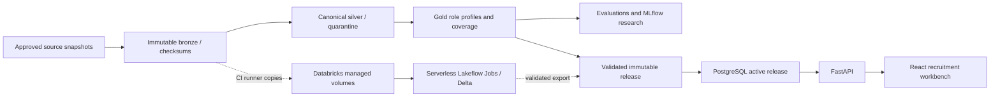

# Architecture and trust boundaries

The local architecture refactor separates three workflows: `master_snapshot` publishes new validated master revisions while policy modules transform staged data; `calibration` supplies shared numerical scoring while the catalogue and role adapters select compatible peers; `lineupPlanner` owns browser planning state while its React adapter owns request transport/cache integration. See [implementation record](architecture-refactor-plan.md) and [domain glossary](../GLOSSARY.md) for contracts and operating limits. Master revisions do not automatically activate application releases.

The portable profile uses Arrow/Parquet and DuckDB. Spark persists Delta tables and SQL exposure summaries; compact role posterior calculations share the tested Python implementation. This is deliberately a small-data workload, with no claim that a 240-player fixture needs distributed computing. Managed-volume exchange isolates Databricks from the public serving API and avoids assuming direct ADLS mounts in Free Edition.

Version identifiers accompany recommendations and seeded scenarios; complete scenario inputs are returned for audit/export. Editable intended-style targets are explicitly manual assumptions. Squad role assignments, entered fees/budget and depth requirements never infer market valuations or registration rights. Data refresh does not retrain models. Historical xG/xT research stays outside current candidate ranking until a separate relevance/coverage acceptance process exists.

HTTP JSON, provider responses, imported notes and Ollama output are untrusted boundaries. Pydantic enforces shapes/ranges; bodies are bounded before parsing; fixed upstream hosts avoid arbitrary server-side fetches; React escapes text; imports limit keys/content. The public API exposes reads and stateless calculations only. Publication/rollback remain CLI/batch operations with database credentials. Browser notes are personal exports, with no hosted account/session system.

Quota enforcement currently uses a local checkpoint and a conservative daily request budget. Single-writer ingestion is required until checkpoint concurrency protection is implemented. Serving throttling is in-memory for the one-replica demo; no distributed or per-end-user identity guarantee is claimed. Upstream ingress and runtime limits still need deployment verification.

Squad Studio at `/` adds an independent versioned dashboard path: curated official Liverpool identities + deterministic demo peer/features → Python position-rating/familiarity functions → typed squad API → browser-local formation planner. The recruitment workbench remains at `/scout`. Snapshot/feature/peer/scoring versions accompany evaluations and exports. This dashboard never writes or activates the recruitment database's release pointer. Its sourced identities do not establish real performance coverage. Server-side reassignment and evaluation validate player uniqueness, slot population, snapshot and settings; imported scores are never trusted. Explore carries a role and explicit demo limitation, with no fabricated Liverpool replacement/team identifiers.
